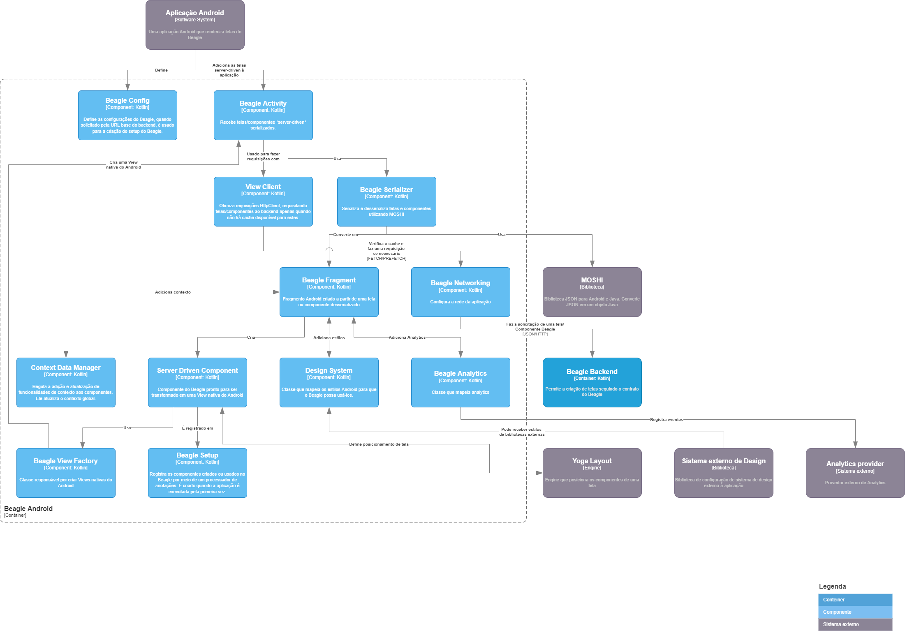

+++
title = "Documentação Arquitetural - Beagle"
date = 2022-06-06
tags = []
categories = []
+++

# Autores

Este documento foi produzido pela equipe abaixo:

---
- Nome: Ana Carolina Chaves de Vasconcelos
- Matrícula: 118110388
- Contato: ana.vasconcelos@ccc.ufcg.edu.br
---
- Nome: Franklin Regis de Oliveira
- Matrícula: 119210030
- Contato: franklin.oliveira@ccc.ufcg.edu.br
---
- Nome: Deilton Vasconcelos Figueiredo Lopes
- Matrícula: 119210094
- Contato: deilton.lopes@ccc.ufcg.edu.br
---
- Nome: Luan Carvalho Pedrosa
- Matrícula: 119210986
- Contato: luan.pedrosa@ccc.ufcg.edu.br

# Descrição Arquitetural do Beagle

Neste website, pode-se conferir a [Arquitetura do Beagle](https://docs.usebeagle.io/c4model/en/#/HOME). Todo o sistema foi documentado se baseando no modelo [C4](https://c4model.com/). Dos "C"s, apenas o quarto "C", código, não foi feito pelos desenvolvedores do sistema.

## Descrição Geral do Beagle

[Beagle](https://github.com/ZupIT/beagle-c4model/tree/v1.0.1) é uma estrutura de código aberto que ajuda os desenvolvedores a implementar a interface do usuário orientada a servidor de maneira multiplataforma .
  
Ao usar o Beagle, os desenvolvedores podem:

* Alterar rapidamente um layout de aplicativo, dados, fluxo de navegação ou até mesmo lógica, apenas alterando o código no back-end.
* Ser mais independente das lojas de dispositivos móveis, como App Store e Play Store, porque a maioria das alterações não precisa de uma atualização de aplicativo.
* Ter mais confiança de que os aplicativos se comportarão de maneira semelhante em diferentes plataformas, pois o código será compartilhado e padronizado entre backend e frontend.
* Testar facilmente novas hipóteses de negócios ou fazer correções ao vivo em aplicativos para melhorar a experiência dos usuários e receber feedback.

## O framework Beagle

### Objetivo Geral

Ser um meio que otimize e auxilie no controle do desenvolvimento de aplicativos em diversas plataformas, fornecendo atualização automática nas lojas digitais e compartilhamento de informações entre o back-end e o front-end a partir de estrututas simples e de facil manuseio.

### Objetivos Específicos

- As telas são renderizadas a partir de um json, essa biblioteca tem uma engine que vc envia um json e ele renderiza para uma tela nativa e isso facilita o seu controle e possiveis modificações.
- O Beagle, por ser Server-Driven UI, sua API informa ao cliente quais componentes irão renderizar e com qual conteúdo. Diante disso, o código pode ser implementado nas mais diversas plataformas e com isso entra-se o poder do Beagle que vai ajudar o desenvolvedor a aplicar esse conceito de uma forma padronizada entre elas.
- Além disso, você consegue construir fluxos de ponta a ponta apenas utilizando esse framework.
- Também é facilita diretamente na comunicação entre componentes e você consegue fazer isso facilmente.

## Contexto

No primeiro nível, podemos ver a aplicação em uma perspectiva macro, os atores, seus papéis e também como eles interagem entre si. O desenvolvedor, ao possuir uma aplicação que deseja integrar com o Beagle, faz as configurações iniciais e de Infraestrutura para se conectar ao Beagle, que então fornecerá as APIs necessárias para criar e manipular componentes Beagle.

Mais detalhadamente, no diagrama de contexto, vemos o Beagle, que é o framework abordado nesse documento, e suas principais dependencias externas, além de um desenvolvedor de software comum que interage com ele.

### Application

- Nesse compartimento acontece a transformacão do JSON para a tela relacionada. Esse JSON é o que o back-end forneceria ao front-end por meio de uma resposta HTTP e o  frontend irá então interpretá-lo e renderizá-lo corretamente na tela da plataforma. Logo, é o servidor que possibilita o envio de objetos JSON para serem renderizados e, consequentemente, visualizados no frontend.
- Esse componente permite que telas e regras de negócios sejam escritas apenas uma vez e depois renderizadas nativamente em cada plataforma onde o Beagle está presente. O consumo das APIs que fornecem os dados para a aplicação antes executados pelas frentes, agora é de responsabilidade da BFF (Back-end para Front-end).

### Beagle

Quando as informações contidas no JSON são desserializadas, o mecanismo de layout entra em ação renderizando os componentes gerados com base no Design System da aplicação e usa o Yoga Layout para renderizar nativamente componentes nas plataformas construindo seus respectivos layouts usando os conceitos do Flexbox.

  

Figura 1. Diagrama de contexto do Beagle

## Componentes

Para melhor exibição, nas Figuras 3, 4 e 5 estão mostrados os componentes de três containers: Backend, Android e Web. 

No Backend do Beagle, existem duas formas de manipular os Models e Contexts da biblioteca, através de um sistema Typescript e outro Kotlin. Nos dois sistemas, uma biblioteca padrão Beagle é criada e contém modelos que possuem contexto, operações, ações e interfaces para interagir com a aplicação do usuário de forma dinâmica e flexível.

Figura 3. Diagrama de componentes para o Beagle Backend

O Beagle Android é responsável por fazer a relação entre o framework Beagle e aplicações Android, permitindo que os componentes recebidos do Backend sejam consumidos e tratados para gerar Views do Android. Os componentes do Beagle são:

- Componentes visuais (botões, textos, campos de texto, etc) padrão e customizados;
- Ações (Navegação, Alerta, SendRequest, etc) padrão e customizadas;
- Operações (Operações aritméticas, operadores lógicos, etc) padrão e customizadas.

Figura 4. Diagrama de componentes para o Beagle Android

Para o Beagle Web, foi feita ums divisão em duas partes:

- A biblioteca Frontend
- O Beagle Web Core

A biblioteca Frontend tem a função de criar uma ponte entre cada um dos frameworks suportados (Angular, React, Flutter) e o Core. Cada um dos frameworks tem os componentes de interface padrão do Beagle, bem como um utilitário para fazer a conexão com o Core para obter as telas nativamente. Neste diagrama, por fins de simplicidade, condensamos o utilitário Angular e o React em uma caixinha apenas, a "*Beagle Typescript*", devido a sua similaridade. 

O Beagle Web Core Tem a base das suas funcionalidades no componente "*Beagle Service*". É a partir dele que o sistema processa e organiza os seus elementos padrões, como componentes e serviços e carrega os seus utilitários. o "*Beagle View*" Utiliza estes utilitários para "traduzir" e renderizar cada tela.

Figura 5. Diagrama de componentes para o Beagle Web

## Visão da Informação

As principais informações coletadas e manipuladas pelo sistema são as da aplicação do usuário, que precisa fornecer parte dos seus dados para que as interfaces sejam geradas e distribuídas pelo backend do Beagle. Apesar de diferentes sistemas frontend poderem ser usados (Android, Web, iOS), o mesmo Backend Beagle é acessado, e a interface então é devolvida ao usuário, com as informações e personalizações que ele forneceu, como pode ser visto na Figura 6.

  

Figura 6. Máquina de estados para a transferência de informação das aplicações no Beagle

