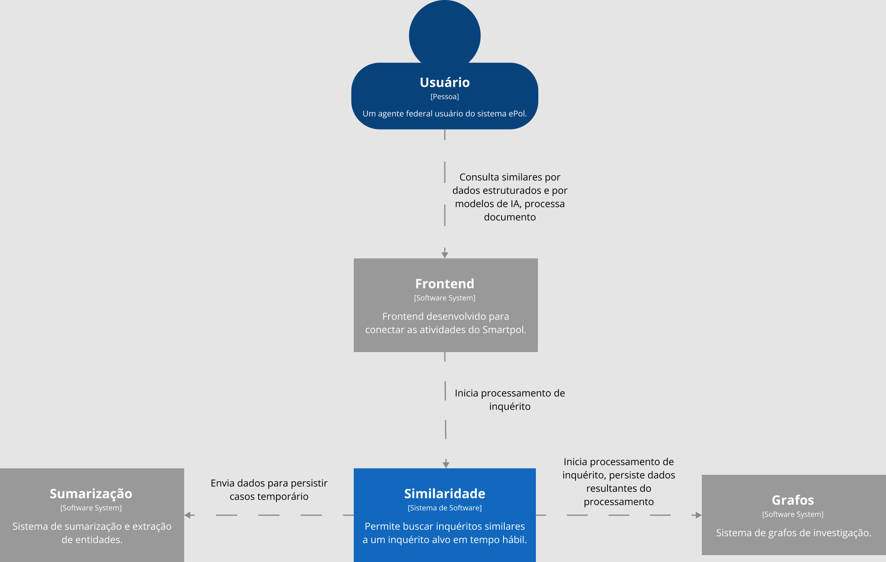
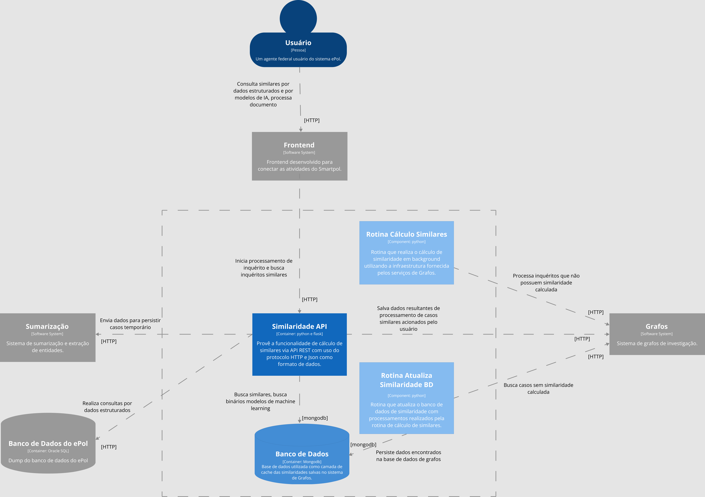
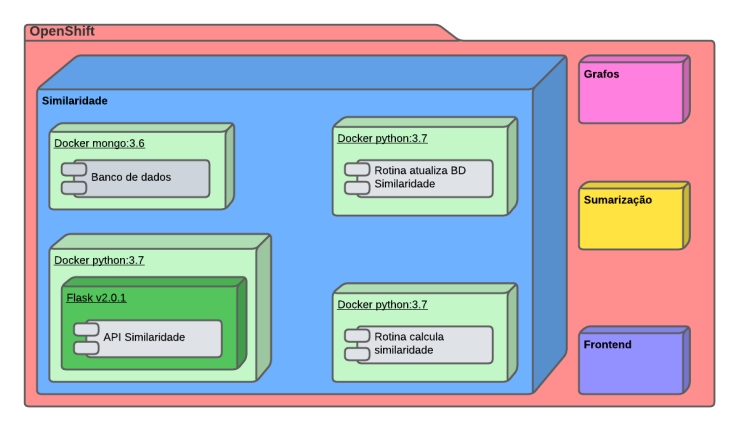
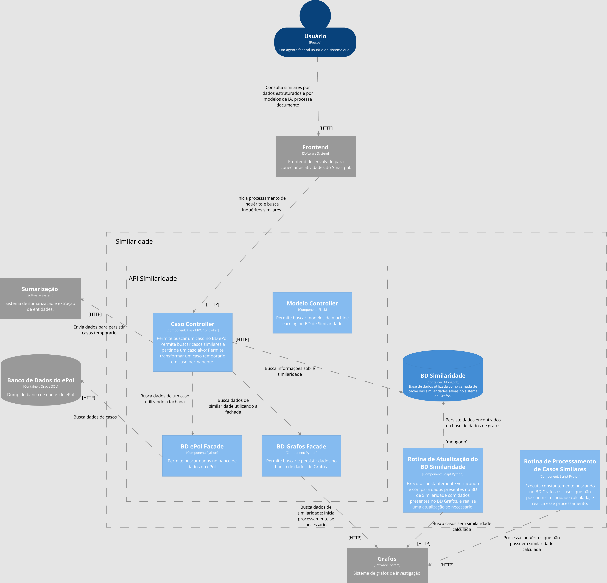
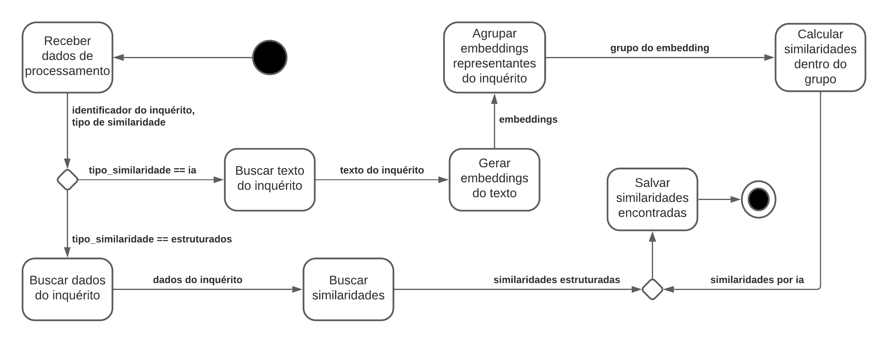

# Descrição Arquitetural – Serviço de similaridade entre inquéritos do ePol

Este documento descreve parte da arquitetura do projeto [ePol](https://github.com/orgs/epol-ufcg/teams/similaridade/repositories). Essa descrição foi baseada principalmente no modelo [C4](https://c4model.com/).

É importante destacar não será descrita toda a arquitetura do ePol. O foco aqui é a descrição de um serviço específico de similaridade entre inquéritos policiais, que é parte fundamental do projeto.

## Autores

Este documento foi produzido por: 

Eric Gonçalves:
- Matrícula: 118210349
- Contato: eric.goncalves@ccc.ufcg.edu.br

Gabriel Souto:
- Matrícula: 118210258
- Contato: gabriel.souto@ccc.ufcg.edu.br

Ruan Gomes:
- Matrícula: 118210616
- Contato: ruan.alves@ccc.ufcg.edu.br

Victor Andrade:
- Matrícula: 118210406
- Contato: victor.andrade@ccc.ufcg.edu.br

## Descrição geral do ePol

O epol é um projeto que visa automatizar o processamento de inquéritos policiais pela Polícia Federal do Brasil. A intenção da etapa atual do projeto, ao qual o serviço a ser documentado pertence, é automatizar a busca por inquéritos policiais similares em tempo real, a partir de sumarização de documentos e geração de grafos de investigação.

## Serviço de Similaridade entre inquéritos

### Objetivo

Implementar um serviço de busca por inquéritos similares a partir de um inquérito alvo, utilizando o texto do inquérito e dados obtidos do mesmo.

### Objetivos Específicos

Queremos encontrar inquéritos similares a partir de um inquérito alvo *on the fly* em tempo hábil. Para isso, utilizamos modelos de *Machine Learning* envolvendo Processamento de Linguagem Natural (PLN), juntamente com busca por dados similares via SQL utilizando dados obtidos de um inquérito alvo.

### Contexto

O usuário, agente da Polícia Federal, utiliza o Frontend do SmartPol para processar documentos, gerar e buscar dados de inquéritos. O Frontend se comunica com o módulo de Similaridade para iniciar e buscar casos similares. O módulo citado anteriormente, cujo é o alvo desse documento, é responsável por iniciar o processamento de similaridade entre inquéritos, realizando a persistência dos resultados desse processamento através de comunicação com o módulo de Grafos. Além disso, juntamente com o módulo de Sumarização e com o módulo de Grafos, é responsável pela transformação de um caso temporário em um caso permanente.



### Containers

A API REST de consulta de similares é feita em Python, utilizando o framework Flask, que permite a busca por inquéritos similares a um inquérito alvo através de modelos de inteligência artificial, ou dados estruturados através de consultas SQL ao BD ePol, e utiliza o JSON como formato de dados, e comunicação através do protocolo HTTP. Também se comunica com a API de Extração do sistema de Sumarização, enviando dados no formato JSON que representam dados extraídos de inquérito temporário, para que a API de Extração persista esse dados.

A base de dados de similaridade é feita utilizando o MongoDB, ele é utilizado como uma camada de cache para evitar sobrecarga de requisições enviadas para a API de acesso a base de dados de Grafos. A API de consulta de similares realiza buscas nessa base de dados, e se não obtiver os dados requeridos, busca os mesmos na base dados de Grafos.
   
A rotina de cálculo de similares é feita em Python, executa constantemente, buscando inquéritos que não possuem similaridade calculada na base de dados de Grafos, e realizando esse processamento, e persistindo as similaridades calculadas utilizando a infraestrutura fornecida pelo sistema de Grafos.
                                                                                      
A rotina de atualização da base de dados de similares é feita em Python, executa constantemente, buscando informações na base de dados de Grafos, compara com as informações existentes na base dados de Similaridade, e persiste na última se houver divergência.

#### Rotas

Dentre as rotas da API REST de similaridade, temos:

##### Buscar caso no BD ePol

```
/caso/<numero_caso>
```

Realiza a busca dos dados de um caso no Banco de Dados do ePol utilizando o número do caso passado como identificador do caso.

##### Buscar casos similares

```
/caso/<node_id>/similares?metodo_similaridade=<tipo_similaridade>
```

Realiza a busca dos casos similares ao caso solicitado (caso identificado na base de dado de Grafos pelo node_id passado) de acordo com o método de similaridade passado como parâmetro de requisição, podendo esse método ser `"ia"` ou `"dados_estruturados"`.

##### Iniciar transição de caso temporário para caso permantente

```
/caso/temporario/<node_id>?salvar=<salvar>
```

Realiza a remoção do caso temporário (identificado pelo node_id passado) e todos os seus arcos de similaridade da base de dados de Grafos e caso o parâmetro salvar for `True`, então é criada uma versão permanente desse caso após sua exclusão e todos os arcos de similaridade são transferidos para esse caso permanente.

A seguir, o diagrama de container do ePol.



#### Implantação

A implantação do sistema de similaridade é feito utilizando containers Docker em todos os serviços, e a configuração da comunicação com outros módulos é feita a partir de variáveis de ambiente, que comumente são utilizados no OpenShift Container Platform, porém como o Docker é um "criador" de ambiente, esses serviços podem ser executados em uma VM. Para mais detalhes, consultar a documentação oficial dos serviços citados. Segue abaixo o diagrama de implantação.



### Componentes

O módulo de Similaridade do ePol é composto por rotinas feitas em Python, sub-módulos feitos em Flask Python, e uma base de dados construída utilizando MongoDB.



- **BD Similaridade**: Base de dados construída em MongoDB. Serve como uma camada de cache para que seja evitado um *overhead* de requisições para a base de dados de Grafos.
- **Caso Controller**: Esse módulo é responsável pela parte de comunicação com o Frontend. É ele que inicia a busca por dados de um inquérito no banco de dados do ePol, que busca inquéritos similares a um inquérito alvo, e também quem inicia a transformação de um caso temporário no banco de dados de Grafos, para um caso permantente.
- **Modelo Controller**: Reponsável por carregar binários de modelos de *Machine Learning*, e transformando-os em objetos Python.
- **BD ePol Facade**: Fachada de acesso ao BD do ePol. É ela que é utilizada quando são requeridas informações de um caso já existente nessa base dados.
- **BD Grafos Facade**: Fachada de acesso ao BD Grafos. Ela é utilizada para buscar informações de similaridade na base de dados de Grafos.
- **Rotina de Cálculo de Similaridade**: Verifica informações de similaridade dos inquéritos presentes na base de dados de Grafos, realizando o processamento dessas informações se um inquérito não as possuir.
- **Rotina de Atualização do BD Similaridade**: Compara informações de similaridade entre a base de dados de Grafos e a base de dados de Similaridade, se houver informação relevante, atualiza essa última.

### Visão de Informação

A API de Similaridade em sua rota de busca por similares, recebe um identificador de um inquérito, um tipo de similaridade a ser cálculada, e em acréscimo, se o tipo de similaridade for dados estruturados, recebe também um JSON com os dados estruturados desse inquérito alvo.

No método de similaridade por inteligência artificial, o identificador do inquérito é utilizado para realizar uma busca pelo texto de um inquérito. A partir desse texto, os embeddings (representação do texto em vetor) são gerados, em seguida agrupados através de um modelo de agrupamento, então as similaridades são calculadas dentro do agrupamento encontrado a partir de operações com vetores, e logo após são salvas no banco de dados de Grafos.

No método de similaridade por dados estruturados, os dados estruturados do inquérito alvo são utilizados para realizar uma comparação com os dados estruturados dos inquéritos presentes no banco de dados do ePol, e a partir disso as similaridades são encontradas, e logo após são salvas no banco de dados de Grafos.

A seguir, o diagrama de fluxo de informação que representa o que foi descrito anteriormente.



