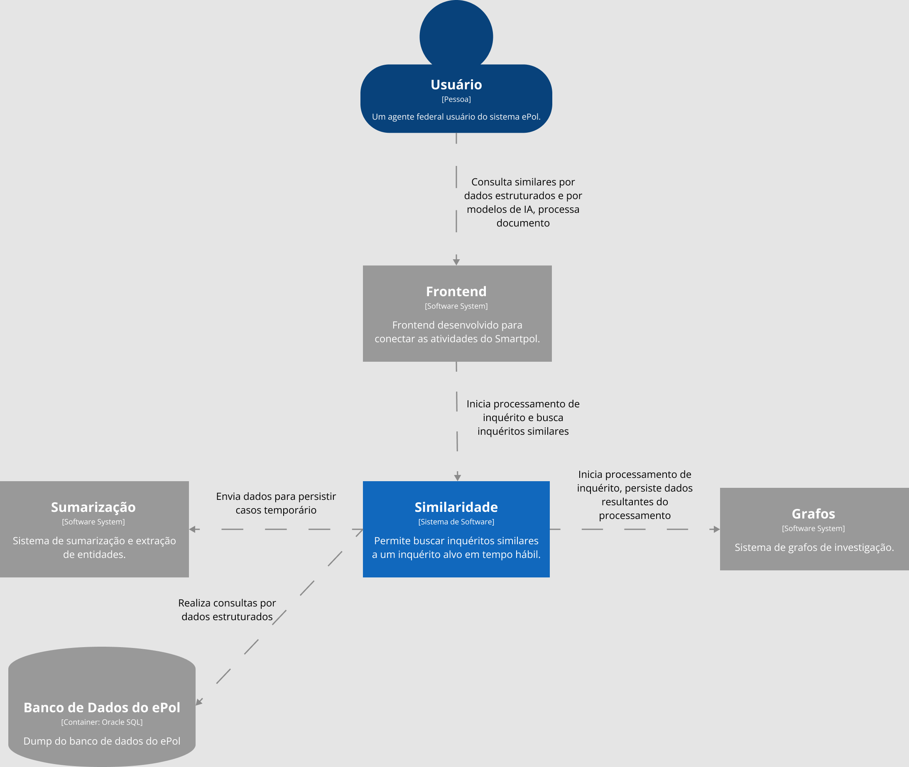

# Descrição Arquitetural – Serviço de similaridade entre inquéritos do ePol

Este documento descreve parte da arquitetura do projeto [ePol](https://github.com/orgs/epol-ufcg/teams/similaridade/repositories). Essa descrição foi baseada principalmente no modelo [C4](https://c4model.com/).

É importante destacar não será descrita toda a arquitetura do ePol. O foco aqui é a descrição de um serviço específico de similaridade entre inquéritos policiais, que é parte fundamental do projeto.

## Autores

Este documento foi produzido por: 

Eric Gonçalves:
- Matrícula: 118210349
- Contato: eric.goncalves@ccc.ufcg.edu.br

Gabriel Souto:
- Matrícula: 118210258
- Contato: gabriel.souto@ccc.ufcg.edu.br

Ruan Gomes:
- Matrícula: 118210616
- Contato: ruan.alves@ccc.ufcg.edu.br

Victor Andrade:
- Matrícula: 118210406
- Contato: victor.andrade@ccc.ufcg.edu.br

## Descrição geral do ePol

O epol é um projeto que visa automatizar o processamento de inquéritos policiais pela Polícia Federal do Brasil. A intenção da etapa atual do projeto, ao qual o serviço a ser documentado pertence, é automatizar a busca por inquéritos policiais similares em tempo real, a partir de sumarização de documentos e geração de grafos de investigação.

## Serviço de Similaridade entre inquéritos

### Objetivo

Implementar um serviço de busca por inquéritos similares a partir de um inquérito alvo, utilizando o texto do inquérito e dados obtidos do mesmo.

### Objetivos Específicos

Queremos encontrar inquéritos similares a partir de um inquérito alvo *on the fly* em tempo hábil. Para isso, utilizamos modelos de *Machine Learning* envolvendo Processamento de Linguagem Natural (PLN), juntamente com busca por dados similares via SQL utilizando dados obtidos de um inquérito alvo.

### Contexto

O usuário, agente da Polícia Federal, utiliza o Frontend do SmartPol para processar documentos, gerar e buscar dados de inquéritos. O Frontend se comunica com o módulo de Similaridade para iniciar e buscar casos similares. O módulo citado anteriormente, cujo é o alvo desse documento, é responsável por iniciar o processamento de similaridade entre inquéritos, realizando a persistência dos resultados desse processamento através de comunicação com o módulo de Grafos. Além disso, juntamente com o módulo de Sumarização e com o módulo de Grafos, é responsável pela transformação de um caso temporário em um caso permanente.

### Containers

A API REST de consulta de similares é feita em Python, utilizando o framework Flask, permitindo a busca por inquéritos similares a um inquérito alvo através de modelos de inteligência artificial, ou dados estruturados, e utiliza o JSON como formato de dados, e comunicação através do protocolo HTTP. Também se comunica com a API de Sumarização, enviando dados no formato JSON que representam um inquérito temporário, para que a API de Sumarização persista esse inquérito.

A base de dados de similaridade é feita utilizando o MongoDB, ele é utilizado como uma camada de cache para evitar sobrecarga de requisições enviadas para a API de acesso a base de dados de Grafos. A API de consulta de similares realiza buscas nessa base de dados, e se não obtiver os dados requeridos, busca os mesmos na base dados de Grafos.
   
A rotina de cálculo de similares é feita em Python, executa constantemente, buscando inquéritos que não possuem similaridade calculada na base de dados de Grafos, e realizando esse processamento, e persistindo os dados logo após, utilizando o protocolo específico do MongoDB nas comunicações.
                                                                                      
A rotina de atualização da base de dados de similares é feita em Python, executa constantemente, buscando informações na base de dados de Grafos, compara com as informações existentes na base dados de Similaridade, e persiste na última se houver divergência, utilizando o protocolo específico do MongoDB nas comunicações.

#### Implantação

A implantação do sistema de similaridade é feito utilizando containers Docker em todos os serviços, e a configuração da comunicação com outros módulos é feita a partir de variáveis de ambiente, que comumente são utilizados no OpenShift Container Platform, porém como o Docker é um "criador" de ambiente, esses serviços podem ser executados em uma VM. Para mais detalhes, consultar a documentação oficial dos serviços citados.

