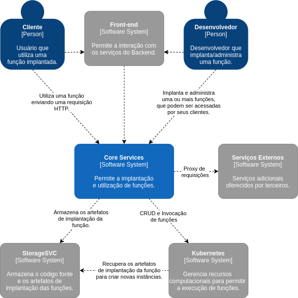

+++
title = "Fission Serverless Platform"
date = 2020-10-10
tags = []
categories = []
+++

***

Este documento descreve diversos aspectos arquiteturais da plataforma de
computação *serverless* para funções-como-serviço - *Fission*.
A promessa dessa plataforma é permitir que desenvolvedores se concentrem
unicamente na tarefa de implementação da lógica de negócio, deixando os detalhes de 
implantação sobre a responsabilidade da plataforma.

***

# Autor

Este documento foi produzido por Paulo Feitosa.

- Matrícula: 116211477
- Contato: paulo.felipe.silva@ccc.ufcg.edu.br
- Projeto documentado: https://github.com/fission/fission

# Descrição Arquitetural - Fission Core Services

Este documento descreve parte da arquitetura do projeto 
[Fission](https://fission.io/). 
Essa descrição foi baseada principalmente no modelo [C4](https://c4model.com/).

É importante destacar que não será descrita toda a arquitetura do Fission. 
O foco deste documento será a descrição arquitetural dos serviços de *core business* da 
plataforma *serverless Fission*.

## Descrição Geral sobre o *Fission*.

*Fission* é uma plataforma de computação serverless para funções-como-serviço que tem 
como objetivo principal retirar dos desenvolvedores toda a carga de implantação de
software. Dessa forma, os programadores podem se preocupar apenas com os detalhes da 
implementação da lógica de negócio. 

A plataforma garante realizar automaticamente o *scale-up* e *scale-down* dos recursos 
computacionais para executar as funções, quando estiverem sobre uma alta ou baixa 
utilização. Mais detalhes sobre a plataforma podem ser acessados 
[aqui](https://docs.fission.io/docs/).

## *Fission Core Services*

### Objetivo Geral

O *Core Services* tem como principais objetivos: 

1. permitir a implantação de funções dentro da plataforma *Fission*; 

2. autorizar o acesso de clientes às funções implantadas; 

### Objetivos Específicos

Para alcançar os objetivos gerais, o *Core Services* provê uma API REST que é ponto
de entrada de diversas operações da plataforma. A API permite a realização de CRUD 
de funções por desenvolvedores, dessa forma, o *Core Services* é o responsável por
interagir com os serviços internos para que a operação seja concluída.
 
Além disso, depois de implantada a função pode ser invocada pelos seus clientes.
Neste caso, a API deve rotear as requisições HTTP para as instâncias que executam 
o código-fonte da função.

### Contexto

O diagrama abaixo apresenta os principais sistemas que interagem com o *Core Services*,
assim como as suas responsabilidades.

### Eventos de entrada

Podemos observar que o *Core Services*, como já descrito anteriormente, também funciona
como o *Back-end* da *Fission*. Os Desenvolvedores e seus Clientes podem interagir 
com a plataforma por meio do *Front-end* ou do *Fission CLI* (um software de linha
de comando). 

Quando os Desenvolvedores realizam a implantação de uma função, a plataforma 
disponibiliza um *endpoint* que pode ser acessado para invocar a execução da função.
Assim, a forma mais comum dos Clientes interagirem com a plataforma é 
pelo disparo de requisições HTTP para invocar funções. 

### Eventos de saída

Como o *Core Services* é o ponto de entrada da plataforma, pode ser razoável imaginar
que todos os recursos sejam resolvidos por esse componente, contudo, diversas tarefas
são delegadas para outros componentes. 

Como apresentado no diagrama acima, o *Kubernetes* é responsável por gerenciar os 
recursos computacionais para permitir que as funções processem requisições dos seus 
clientes. Dessa forma, o *Core Services* precisa interagir com o Kubernetes para 
realizar o CRUD de funções, além de consultar os endereços das réplicas da função
para roteá-las. O *Kubernetes* também é o responsável por realizar o escalonamento
das instâncias em execução da função com base na métrica de utilização de CPU.

Quando um desenvolvedor realiza o *deployment* de uma função, o *Core Services* se 
encarrega de transformar o código-fonte em uma função implantável. Após o processo de 
*build*, o *StorageSVC* é o responsável por armazenar os artefatos de 
implantação resultantes. Dessa forma, quando necessário, o *Kubernetes* pode recuperar
esses artefatos para criar novas réplicas da função.