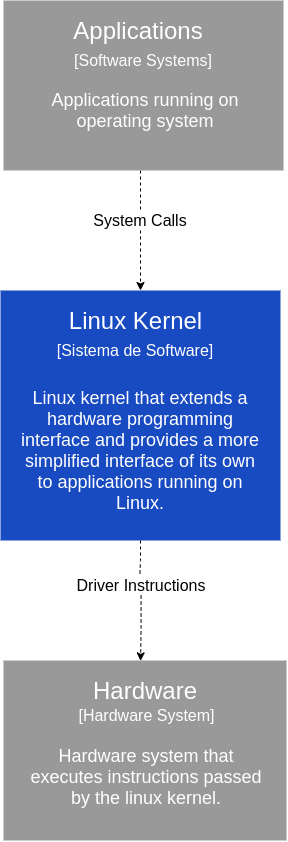
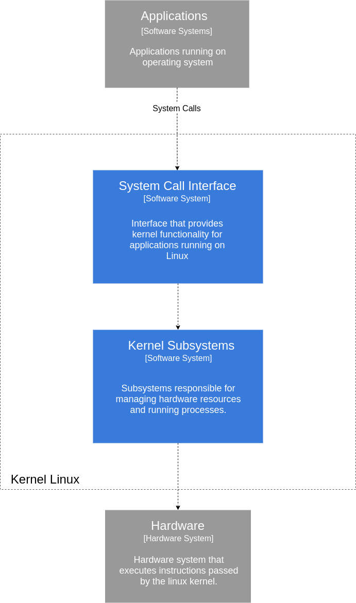
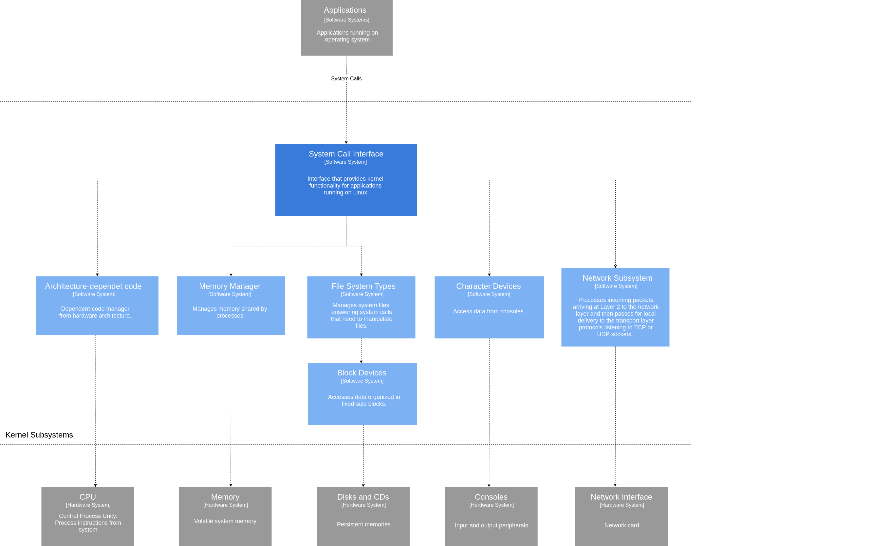

# Autor

Este documento foi produzido por Italo Modesto Pereira.

- Matrícula: 116211154
- Contato: italo.pereira@ccc.ufcg.edu.br
- Projeto documentado: https://github.com/torvalds/linux

# Descrição arquitetural - Kernel do Linux

Este documento descreve a arquitetura do [kernel do Linux](https://github.com/torvalds/linux). E esta descrição segue o modelo [C4](https://c4model.com/).

## Sobre o Kernel do Linux

O Kernel, ou núcleo, do linux é a parte do sistema operacional (SO) responsável por gerenciar os recursos de hardware do sistema computacional e também é responsável pela sincronização dos processos que executam nesse SO. 

### Contexto

</img>

Quando as aplicações que estão em execução no linux precisam de uma operação do hardware, como por exemplo buscar dados no disco ou simplesmente processar algum comando, essas aplicações não têm permissão para acessar o hardware diretamente. Para intermediar essa comunicação, e fazer muito mais do que isso, existe o kernel, que estende a interface de programação do hardware provendo a sua pŕopria interface para as aplicações, a system call interface (interface de chamadas ao sistema).
Uma vez que o kernel recebe as chamadas ao sistema das aplicações, ele gerenciará todos os recursos de hardware necessários para atender àquela chamada. 

### Containers

</img>

Abrindo o kernel para analisar os componentes que o compõem, aqui chamados de containers, encontramos os seguintes componentes:
*Applications*, que representa as aplicações que executam no linux e se comunicam com o kernel através de chamadas ao sistema. *System Call Interface*, que representa a interface de chamadas ao sistema que é provida pelo kernel e consumida pelas aplicações que executam no SO. E por fim, os *Kernel Subsystems*, que representa os subsistemas do kernel que recebem as chamadas ao sistema das aplicações, por meio da interface de chamadas ao sistema, e gerenciam os recursos de hardware necessários para atender a essas chamadas.
 

### Componentes

</img>

Abindo o container *Kernel Subsystems*, podemos encontras os seguintes componentes: *Architecture-dependent code*, que é o componente no qual estão os códigos dependentes da arquitetura do hardware que compõe a máquina. Ele é responsável por organizar o esquema de diretórios e se comunica diretamente com a unidade central de processamento (do inglês, CPU). *Memory Manager*, que é o componente responsável pela alocação, relocação e proteção da memória. É esse componente que gerencia o consumo da memória entre os diversos processos que executam no linux. Como é de se esperar, ele se comunica diretamente com a memória RAM para antender às demandas solicitadas pelas aplicações, via system calls. *File System Types*, que é o componente responsável pela manipulação de arquivos, quando operações como essa são requisitadas pelas aplicações. E se comunica diretamente com o *Block Devices*, que por sua vez é responsável pelo acesso (escrita e leitura) aos dados em disco. *Character Devices*, que é o componetne responsável pelo acesso (escrita e leitura) aos dados dos consoles. *Network Subsystem*, que no envio de dados pela rede, esse componente é responsável por porcessar os pacotes que chegam na camada de transporte e entregam-nos para a camada de rede. No recebimento de dados da internet, esse componente faz o caminnho inverso, processando esses pacotes da camada de rede para a camada de transporte. Além disso, existem componentes externos ao kernel, que são os hardwares. Sendo eles, a *CPU*, que é o hardware responsável por processar as instruções de máquina e se comunica diretamente com o Architecture-dependent code. A *Memory*, que é responsável pelo armazenamento volátil dos processos em execução e arquivos necessários para a execução dos mesmos. Este componente se comunica diretamente como  *Manager Memory*, que é o componente responsável por gerenciar esse recurso de hardware, como foi dito acima. Os *Disks and CDs*, que representam os dispositivos de armazenamento persistentes e se comunicam com o *Block Devices*, para armezar ou fornecer dados. Os *Consoles*, que representam os periféricos de entrada e saída (E/S) que se comunicam diretamente com o *Character Devices*. O *Network Interface*, que processa os pacotes da camada de rede para a camada de enlace. 

### Código

<pre>
Nesta etapa não faremos diagramas que apresentam detalhes da
implementação. Faremos isso mais adiante.
</pre>

### Visão de Informação

**Obs.**: no diagrama de informação, as setas e contornos pontilhados roxos indicam que aquele fluxo ou etapa é opcional.

O objetivo do usuário do Anki é estudar seus baralhos; para isso, ele precisa criá-los, tendo a opção de buscar um pronto no AnkiWeb (Shared) ou criar um novo, seguindo o fluxo de informação indicado. Já tendo baralhos com cartões, o usuário sincroniza sua coleção com o AnkiWeb antes e depois de estudá-los.
