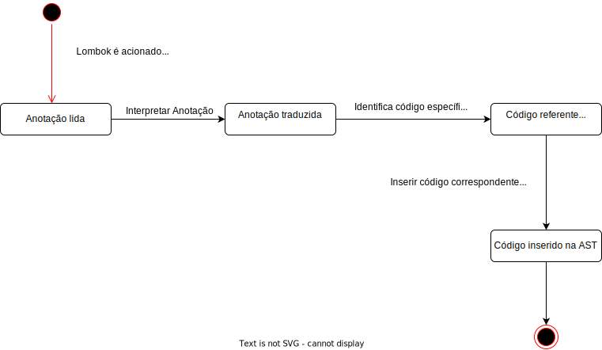

+++
title = "Documento Arquitetural - Lombok"
date = 2022-06-06
tags = []
categories = []
+++

# Autores

Este documento foi produzido por:

Augusto Gomes dos Santos

- Matrícula: 118210273
- Contato: augusto.santos@ccc.ufcg.edu.br

Lucas Brasileiro Raposo

- Matrícula: 119110321
- Contato: lucas.raposo@ccc.ufcg.edu.br

Renildo Dantas Melo

- Matrícula: 118210324
- Contato: renildo.melo@ccc.ufcg.edu.br

Wander Medeiros de Brito Junior

- Matrícula: 118210940
- Contato: wander.junior@ccc.ufcg.edu.br


# Descrição Arquitetural -- Lombok

Este documento descreve a arquitetura do [Lombok](https://github.com/projectlombok/lombok).

# Introdução

O Lombok é uma biblioteca em Java baseada em anotações, voltadas para substituir códigos conhecidos por serem replicados em diversos trechos do código, evitando um trabalho repetitivo e tedioso de se escrever.
Ele atua durante o processo de compilação do programa, quando a bibliotece injeta o bytecode do código "boilerplate" nos arquivos .class.

## Objetivo Geral

Permitir que os usuários, por meio de simples anotações, não precisem escrever código que normalmente é repetitivo e chato de se escrever, a exemplo de construtores com todos os atributos, ou sem atributo algum, e outros métodos “obrigatórios”, como equals, toString, HashCode e os getters e setters.

# Contexto

Para fazer uso do Lombok, o usuário deve adicionar a anotação correspondente ao código desejado, a declaração de algum atributo da classe, ou de toda a classe, caso seja desejado que o código seja adicionado para todos os atributos da classe.

Durante a compilação, quando as anotações são processadas, o Lombok injeta o código representado pela anotação e o compilador continua o processo de compilação, ao fim, os arquivos .class serão gerados como se o .java possuísse o código inserido pelo Lombok. 


# Container

Como o Lombok é uma biblioteca, um framework utilizado em aplicações back-end, e o único sistema que o envolve é o seu próprio, não é possível dividir em outros sistemas, logo pode ser representado por apenas um único container.

Algumas funcionalidades e exemplos do uso Lombok podem ser vistas abaixo:


### Código normal:
```java
    public class Aluno {
        private Long matricula;
        private String nome;

        public Aluno(){
        }
        public Aluno(Long matricula, String nome){
            this.matricula = matricula;
        }
    }
```

### Código utilizando o Lombok:
```java
    @NoArgsConstructor
    @AllArgsConstructor
    public class Aluno {
        private Long matricula;
        private String nome;

    }
```

### Código normal:
```java
    public class Aluno {
        private Long matricula;
        private String nome;
                      
        public Long getMatricula() {
            return matricula;
        }

        public void setMatricula(Long matricula) {
            this.matricula = matricula;
        }

        public String getNome() {
            return nome;
        }

        public void setNome(String nome) {
            this.nome = nome;
        }
            
    }
```

### Código utilizando o Lombok:
```java
    @Getter
    @Setter
    public class Aluno {
        private Long matricula;
        private String nome;

    }
```

# Componentes

O Lombok possui quatro componentes principais:

**AnnotationProcessorHider**: É carregado pelo Lombok.jar no processo de compilação e serve como ponto de partida para o processamento de anotações Lombok.

**ShadowClassLoader**: Procura por arquivos .SLC.lombok e inicia o AnnotationProcessor.

**AnnotationProcessor**: Reconhece o ambiente em que o lombok se encontra e delega para o sub-processador correspondente.

**LombokProcessor**: Traduz as anotações para o código correspondente e injeta na Árvore sintática abstrata.


# Código

<pre>
Nesta etapa não faremos diagramas que apresentam detalhes da
implementação. Faremos isso mais adiante.
</pre>

#  Visão de informação

Para essa etapa vamos em demonstrar o fluxo de execução, do processamento de uma anotação Lombok em determinada classe.



# Contribuições Concretas

Ainda não foram abertas PRs para o repositório oficial do Lombok porque ainda é necessário validar a documentação já produzida e provavelmente é necessário produzir uma versão em inglês.
