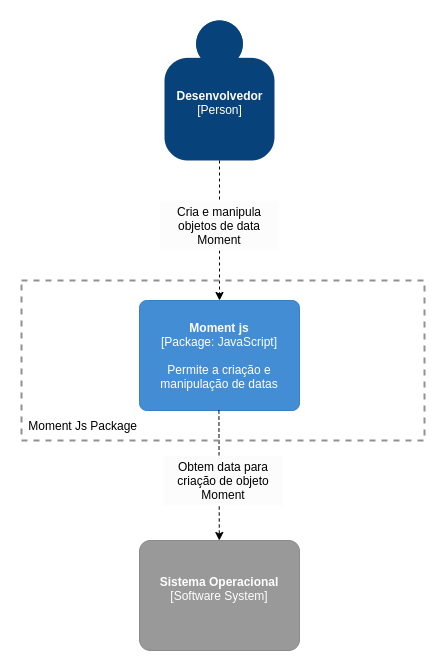
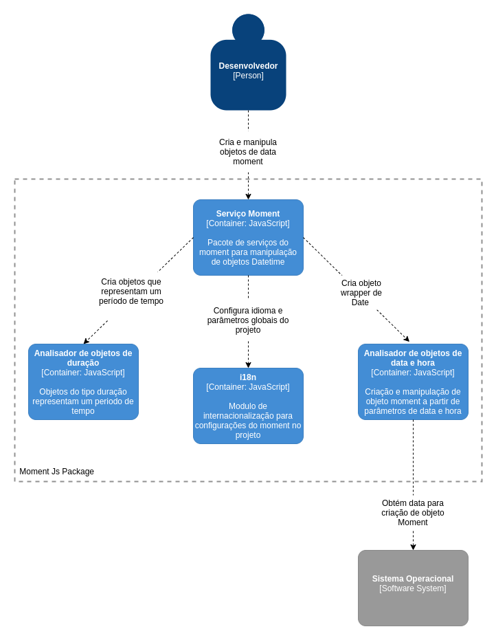
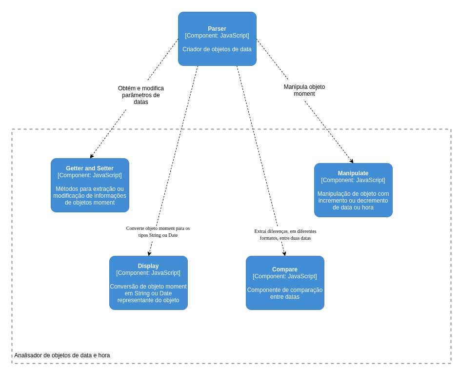

+++
title = "Moment Js"
date = 2019-10-10
tags = []
categories = []
+++

---

Este é um documento explica aspectos da arquitetura de uma das mais conhecidas bibliotecas JavaScript para manipulação de data e hora. O Moment
torna a tarefa de manipulçação de data mais simples para o desenvolvedor.

---

# Autores

Este documento foi produzido por Paulo Dantas.

- Matrícula: 115211312
- Contato: paulo.dantas@ccc.ufcg.edu.br
- Projeto documentado: https://github.com/moment/moment/

# Descrição Arquitetural -- Moment

Este documento descreve parte da arquitetura do projeto [Moment](https://github.com/moment/moment/). Essa descrição foi baseada principalmente no modelo [C4](https://c4model.com/).

## Descrição Geral sobre o Moment

O Moment tem como objetivo disponibilizar ao desenvolvedor ferramentas para a criação e manipulação de datas em projetos JavaScript.
Ele dispõe de um conjunto de funções que tem como objetivo auxiliar o trabalho do desenvolvedor, fazendo com que o trabalho com objetos do tipo Date se torne mais simples.

## O Serviço de manipulação de datas do Moment

### Objetivo Geral

Criar objetos do tipo Date que são facilmente convertidos, formatados e manipulados. Proporcionando, deste modo, que o desenvolvedor escreva códigos mais simples e concisos.

### Objetivos Específicos

Auxiliar no desenvolvimento de projetos que manipulam datas e horas, a partir da criação de objetos mutáveis que são simples de serem trabalhados.

### Contexto

### Containers

### Componentes

### Código

<pre>
Nesta etapa não faremos diagramas que apresentam detalhes da
implementação. Faremos isso mais adiante.
</pre>

### Visão de Informação

Aqui você deve descrever as informações importantes que são coletadas, manipuladas, armazenadas e distribuídas pelo sistema. Você não precisa descrever todas as informações, somente uma parte que seja essencial para o sistema. Por exemplo, se eu estivesse tratando do instagram, faria algo relacionado aos posts.

Além da descrição gostaria de ver aqui um diagrama para descrever os estados (ex: máquina de estados) de uma informação de acordo com as ações do sistema.

# Contribuições Concretas

_Descreva_ aqui os PRs enviados para o projeto e o status dos mesmos. Forneça os links dos PRs.
