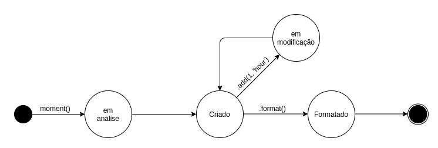

+++
title = "Moment Js"
date = 2019-10-10
tags = []
categories = []
+++

---

Este é um documento explica aspectos da arquitetura de uma das mais conhecidas bibliotecas JavaScript para manipulação de data e hora. O Moment
torna a tarefa de manipulçação de data mais simples para o desenvolvedor.

---

# Autores

Este documento foi produzido por Paulo Dantas.

- Matrícula: 115211312
- Contato: paulo.dantas@ccc.ufcg.edu.br
- Projeto documentado: https://github.com/moment/moment/

# Descrição Arquitetural -- Moment

Este documento descreve parte da arquitetura do projeto [Moment](https://github.com/moment/moment/). Essa descrição foi baseada principalmente no modelo [C4](https://c4model.com/).

## Descrição Geral sobre o Moment

O Moment tem como objetivo disponibilizar ao desenvolvedor ferramentas para a criação e manipulação de datas em projetos JavaScript.
Ele dispõe de um conjunto de funções que tem como objetivo auxiliar o trabalho do desenvolvedor, fazendo com que o trabalho com objetos do tipo Date se torne mais simples.

## O Serviço de manipulação de datas do Moment

### Objetivo Geral

Criar objetos do tipo Date que são facilmente convertidos, formatados e manipulados. Proporcionando, deste modo, que o desenvolvedor escreva códigos mais simples e concisos.

### Objetivos Específicos

Auxiliar no desenvolvimento de projetos que manipulam datas, a partir da criação de objetos mutáveis que são simples de serem trabalhados.

### Contexto

O Moment é um pacote que possui diversas ferramentas para manipulação de datas. Tornando mais simples a contrução de datas e a sua conversão para diferentes formatos. Deste modo, ele não utiliza nenhuma API externa, fazendo utilização apenas do sistema computacional na qual está sendo utilizado.

Na criação de um objeto moment, o construtor extrai a data do sistema computacional na qual está inserido. Deste modo, permite a utilização do moment em um sistema offline e em qualquer plataforma.

### Containers

A principal funcionalidade do Moment Js é a criação e manipulação de datas, mas, além disso, ele também apresenta um modulo para internacionalização e um módulo que é responsável pela criação de objetos de duração, que são representantes de periodos de tempo.

### Componentes

### Código

<pre>
Nesta etapa não faremos diagramas que apresentam detalhes da
implementação. Faremos isso mais adiante.
</pre>

### Visão de Informação

# Contribuições Concretas

_Descreva_ aqui os PRs enviados para o projeto e o status dos mesmos. Forneça os links dos PRs.
