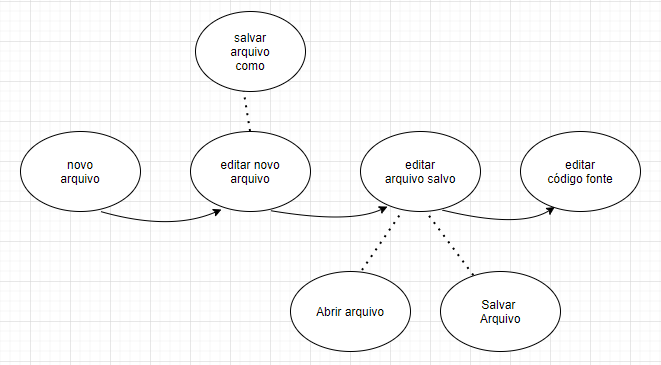

# Autores

Este documento foi escrito por Enzo Raian Teixeira Candido.

- Matrícula: 116210499
- Contato: enzo.candido@ccc.ufcg.edu.br
- Projeto Documentado: https://github.com/notepad-plus-plus/notepad-plus-plus

# Descrição Arquitetural do Notepad++

Este documento descreve a arquitetura do projeto [Notepad++](https://github.com/notepad-plus-plus/notepad-plus-plus). Essa descrição foi baseada principalmente no modelo [C4](https://c4model.com/).

## Descrição Geral sobre o Notepad++

O Notepad++ é um editor de texto de software livre de código-fonte gratuito, é baseado no controlde de edição Scintilla e escrito em C++ e usa Win32 API e STL, promovendo uma maior velocidade de execução e um tamanho reduzido do programa, seu uso é regido pela [GNU General Public License](https://www.gnu.org/licenses/old-licenses/gpl-2.0.html). Mais detalhes sobre o projeto podem ser vistos [neste link](https://notepad-plus-plus.org/).

### Objetivo Geral

A Ferramenta tem como objetivo o apoio para ajudar na edição de arquivos, automatização de tarefas repetitivas, produtividade e aceleração no desenvolvimento de software.

### Objetivos Específicos

Otimizar ao máximo a rotina de programadores sem perder a facilidade de uso, o Notepad++ é uma ferramenta pequena e simples que permite trabalhar com arquivos de textos simples e código-fonte de várias linguagens de programação.

**Seus pontos de Destaque são:**

+ É um software open source e gratuito, que é um ótima opção para quem opera com baixo orçamento.

+ Possui uma interface do usuário totalmente personalizável.

+ É Multilinguagem: Suporta várias linguagens de programação através do uso do "sistema de definição de linguagem integrado".

+ É uma aplicação leve, simples e fácil de usar.

+ Possui autocomplete, que aumenta a produtividade na escrita do código-fonte.

### Contexto

O Notepad++ é uma aplicação nativa para windows. O autor considerou reconstruir o programa para que fosse possível rodá-lo no MacOS e Linux, mas teve que desistir da ideia pelo fato da arquitetura e codificação da ferramenta estarem fortemente acopladas a como o Windows funciona.

### Containers

Através da camada da API da plataforma, é possível implementar alguns métodos virtuais e se conectar ao mecanismo de eventos por meio de mensagens e COM no Windows. 

Possui extensão com sistema de plugins e suporte a macros, permitindo integrar várias outras funcionalidades a ferramenta. Atualmente, mais de 140 plugins são compatíveis com o Notepad++, dos quais 10 estão incluídos na ferramenta.

Oferece suporte a internacionalização por meio de arquivos XML em um formato específico do aplicativo, contendo todas as strings internacionalizadas em um determinado idioma. Este arquivo pode ser carregado nas configurações da ferramenta e as traduções para novos idiomas podem ser escritas ediando um arquivo existente.
Através da API 

[Imagem Diagrama de Container e Implantação]

### Componentes

Abrindo o container de plugins do Notepad++, temos uma galeria de plugins com todos os 140 disponíveis listados de forma alfabética para o usuário. A partir dessa lista, o usuário pode escolher fazer o donwload de um ou mais plugins. O componente responsável por baixar o plugin entra em ação e após o donwload repassa os arquivos para o instalador do plugin.

[Imagem Diagrama de Componentes]

### Código

<pre>
Nesta etapa não faremos diagramas que apresentam detalhes da
implementação. Faremos isso mais adiante.
</pre>

### Visão da Informação

O Notepad++ é uma aplicação que depende de controles, que são blocos elementares em uma interface gráficas, tais como botões, campos de texto, ícones, barras de rolamento entre outros. 

O [Scintilla](https://www.scintilla.org/) é o controle de edição e tem bastante importância para o Notepad++. Ele representa o controle RichText padrão que existe no bloco de notas básico, entretanto com o incremente do novas funcionalidades relativas a edição do código-fonte, principalmente o destaque de sintaxe.

# Contribuições Concretas

*Até o momento não foi aberto nenhum pull request desta documentação para o [repositório](https://github.com/notepad-plus-plus/notepad-plus-plus) do Notepad++.*

