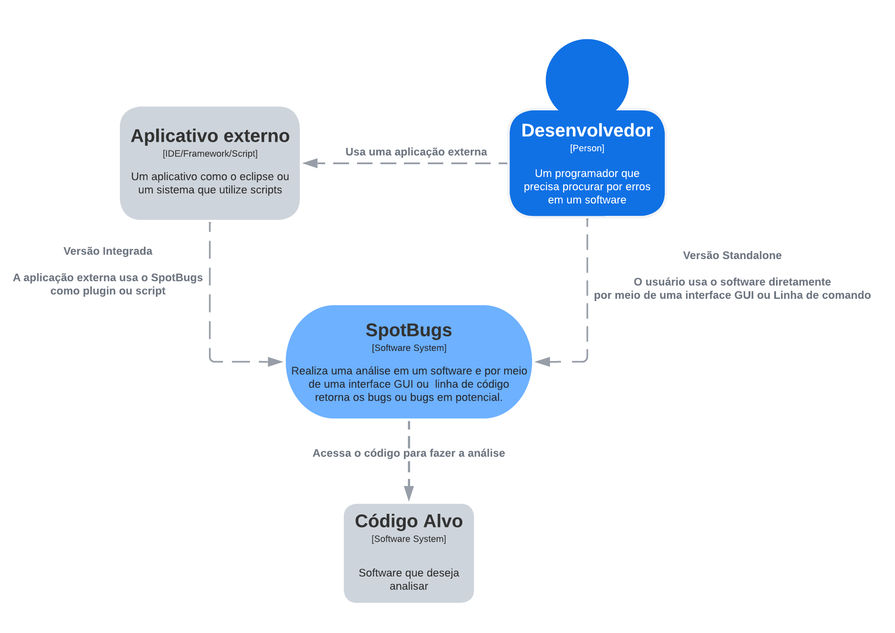

# SpotBugs

# Autores

Este documento foi produzido por: 

Arthur Dantas Porto
- Matrícula: 118210628
- Contato: joao.arthur@computacao.ufcg.edu.br

Renan Nunes Viana
- Matrícula: 118210164
- Contato: joao.arthur@computacao.ufcg.edu.br

Willy Guimarães Moraes Barros
- Matrícula: 118210278
- Contato: joao.arthur@computacao.ufcg.edu.br

Victor Paiva dos Santos
- Matrícula: 118210854
- Contato: joao.arthur@computacao.ufcg.edu.br

- Projeto documentado: https://github.com/spotbugs/spotbugs

# Descrição Arquitetural

Este documento descreve parte da arquitetura do projeto [SpotBugs](https://github.com/spotbugs/spotbugs). Essa descrição foi baseada principalmente no modelo [C4](https://c4model.com/).

É importante destacar não será descrita toda a arquitetura do SpotBugs. 

## Descrição Geral sobre o SpotBugs

SpotBugs is a program which uses static analysis to look for bugs in Java code. It is free software, distributed under the terms of the [GNU Lesser General Public License.](http://www.gnu.org/licenses/lgpl-3.0.html)

SpotBugs is a fork of [FindBugs](http://findbugs.sourceforge.net/) (which is now an abandoned project), carrying on from the point where it left off with support of its community. Please check [the official manual](https://spotbugs.readthedocs.io/en/latest/) for details.

SpotBugs requires JRE (or JDK) 1.8.0 or later to run. However, it can analyze programs compiled for any version of Java, from 1.0 to 1.9.

# O SpotBugs

## Objetivo Geral

Implementar um serviço para analisar e retornar bugs e possíveis bugs de um código de um Software alvo.

## Objetivos Específicos

Queremos ter acesso a o que pode apresentar erro, e o que já apresenta erro. Tendo isso em mãos eu devo escolher o que fazer e como fazer para resolver. Toda essa interação deve ser feita por uma interface GUI ou por linha de comando, além da opção de ser integrado por um aplicativo externo.

## Contexto

O SpotBugs é um sistema simples, que pode ser usado de forma standalone ou integrado em algum aplicativo externo, como um  plugin do eclipse por exemplo.

O Desenvolvedor precisa escolher como usar o software, seja pela opção standalone ou integrada. 

Obviamente é necessário também um software alvo para que o sistema seja direcionado.

