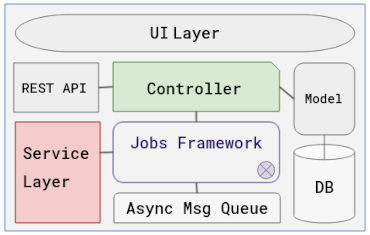

+++
title = "Documentação Arquitetural do Transtats"
date = 2022-06-06
tags = []
categories = []
+++

# Autores

Este documento foi produzido por:

Dante de Araújo Costa
- Matrícula: 119210045
- Contato: dante.costa@ccc.ufcg.edu.br

Erick Morais de Sena
- Matrícula: 118111393
- Contato: erick.sena@ccc.ufcg.edu.br

Francicláudio Dantas da Silva
- Matrícula: 118210343
- Contato: franciclaudio.silva@ccc.ufcg.edu.br

Gustavo Farias de Souza Silva
- Matrícula: 118210480
- Contato: gustavo.silva@ccc.ufcg.edu.br

- Projeto documentado: https://github.com/transtats/transtats

# Descrição Arquitetural -- Transtats

Este documento descreve a arquitetura da aplicação [Transtats](https://github.com/transtats/transtats). Essa descrição foi baseada principalmente no modelo [C4](https://c4model.com/).

## Descrição Geral sobre o Transtats

O Transtats é uma aplicação open source para auxiliar desenvolvedores de software que trabalham com versões de código em diferentes linguagens, realizando, dentre outras coisas, a tradução do código fonte de forma automatizada. Essa tradução é feita a partir da extração e atualização de recursos de idioma com base nos padrões de adaptação de software Internationalization (i18n) e Localization (l10n). Além da função de tradução do código, o Transtats também gera estatísticas do progresso de tradução, procura por erros de traduções e notifica os membros da equipe.

## Contexto
Como visto na imagem, o "framework Jobs" ilustrado centraliza o processamento para auxiliar na tarefa de localização do idioma, interagindo com o Controller, com a camada responsável pelas mensagens e com a outra camada de Serviço. Ela tem acesso a informações sobre o lançamento do produto e seu respectivo cronograma, repositório de origem do pacote, plataforma de tradução de pacotes e sistema de compilação de pacotes para poder fazer isso. Já a API REST fica responsável por registrar e ou manipular os pacotes e prover informações e gráficos sobre um determinado trabalho.

## Componentes

