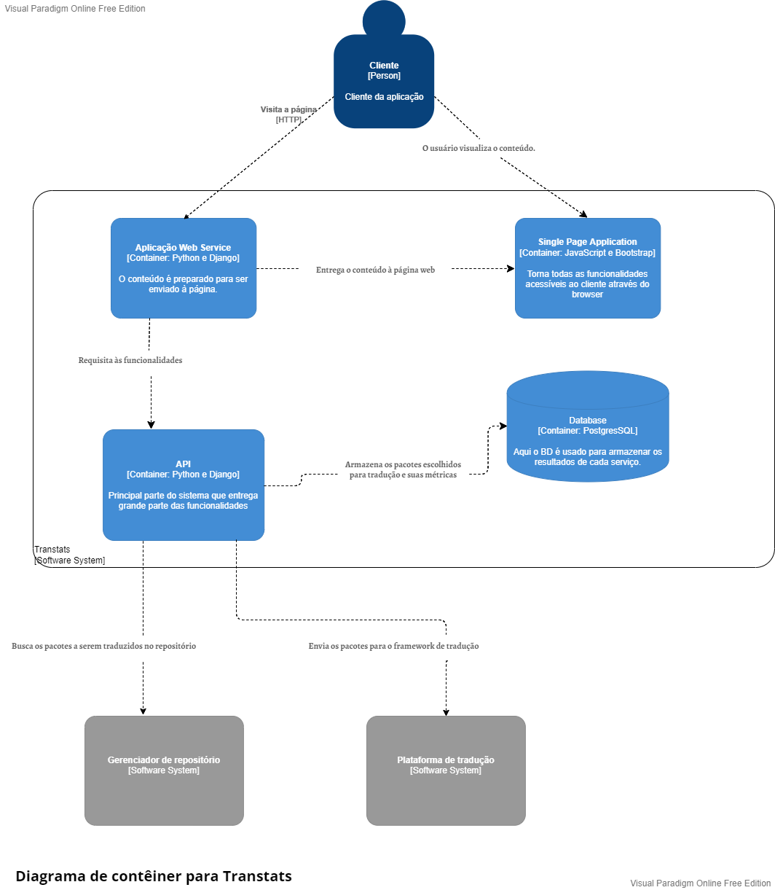

+++
title = "Documentação Arquitetural do Transtats"
date = 2022-06-06
tags = []
categories = []
+++

# Autores

Este documento foi produzido por:

Dante de Araújo Costa
- Matrícula: 119210045
- Contato: dante.costa@ccc.ufcg.edu.br

Erick Morais de Sena
- Matrícula: 118111393
- Contato: erick.sena@ccc.ufcg.edu.br

Francicláudio Dantas da Silva
- Matrícula: 118210343
- Contato: franciclaudio.silva@ccc.ufcg.edu.br

Gustavo Farias de Souza Silva
- Matrícula: 118210480
- Contato: gustavo.silva@ccc.ufcg.edu.br

Projeto documentado: https://github.com/transtats/transtats

# Descrição Arquitetural -- Transtats

Este documento descreve a arquitetura da aplicação [Transtats](https://github.com/transtats/transtats). Essa descrição foi baseada principalmente no modelo [C4](https://c4model.com/).

## Descrição Geral sobre o Transtats

O Transtats é uma aplicação open source para auxiliar desenvolvedores de software que trabalham com versões de código em diferentes linguagens, realizando, dentre outras coisas, a tradução do código fonte de forma automatizada. Essa tradução é feita a partir da extração e atualização de recursos de idioma com base nos padrões de adaptação de software Internationalization (i18n) e Localization (l10n). Além da função de tradução do código, o Transtats também gera estatísticas do progresso de tradução, procura por erros de traduções e notifica os membros da equipe.

## O Serviço do Transtats

### Objetivo Geral

Automatizar o processo de tradução de pacotes de código e informar métricas e estatísticas do progresso da tradução.

### Objetivos Específicos

Compilar as estatística do processo de tradução em componentes visuais, como gráficos e tabelas, realizar a tradução para diversas línguas, avaliar a cobertura da tradução e agrupar traduções específicas por releases.

### Contexto


Em uma visão mais geral da aplicação, o gerenciador do Transtats é responsável pelo processamento das informações sobre o progresso e processo da tradução, ele interage com o banco de dados para a leitura/escrita e sincronização dos dados, a partir disso o sistema é capaz de gerar tanto gráficos como relatórios com as estatísticas em relação às releases. Ainda relacionado ao gerenciador, fica também a parte de criação das mensagens/notificações à equipe(desenvolvedores, gerentes, time de qualidade etc).


### Containers



Os quatro contêiners principais que compõem o Transtats são a Aplicação Web, uma Aplicação Single Page (SPA), a API, e o BD.

A Aplicação Web é escrita em `Python`, usa `Django` como framework web e é servida pelo `Apache`. Ela se comunica com a SPA entregando o conteúdo requisitado, além de se comunicar com a API repassando as requisições feitas pelo usuário.

A SPA é escrita em `JavaScript`, utiliza o `Bootstrap` como framework front-end e se comunica apenas com a Aplicação Web notificando sobre as ações do usuário com a página.

O BD utilizado pelo sistema é o `PostgresSQL` e serve para armazenar os pacotes escolhidos pelo usuário para serem traduzidos e suas métricas.

A API é escrita em Python, usa Django e se comunica com:
- a Aplicação Web, respondendo às requisições; 
- com o gerenciador de repositório, fazendo a busca do pacote pelo link do repositório indicado;
- com a plataforma de tradução, onde os pacotes serão traduzidos; 
- com o BD, onde os pacotes e as métricas são armazenados.

Algumas funcionalidades que a API oferece são:

Adiciona um pacote ao Transtats:
```
POST /api/package/create 
```
**Exemplo**

- Request
```
curl -d '{
    "package_name": "dnf", 
    "upstream_url": "https://github.com/rpm-software-management/dnf",
    "transplatform_slug": "WLTEFED", 
    "release_streams": "fedora,RHEL"
}' 
-H "Authorization: Token <your-transtats-api-token>" 
-H "Content-Type: application/json" 
-X POST http://localhost:8080/api/package/create 
```
- Response
```
{
    "dnf":"Package added Successfully."
}
```

Verifica a saúde de um pacote
```
GET /api/package/<package_name>/health 
```

Recupera o status de tradução de um pacote
```
GET /api/package/<package_name> 
```

Executa um job
```
POST /api/job/run
```
**Exemplo**
- Request
```
curl -d '{
    "job_type": "syncdownstream", 
    "package_name": "anaconda", 
    "build_system": "koji", 
    "build_tag": "f33"
}' 
-H 'Content-Type: application/json' 
-H 'Authorization: Token <your-transtats-api-token>' 
-X POST http://localhost:8080/api/job/run
```
- Response
```
{
    "Success":"Job created and logged. URL: http://localhost:8080/jobs/log/2a5966a9-3e5e-4ad1-b89e-1ee0e3b1651b/detail",
    "job_id":"2a5966a9-3e5e-4ad1-b89e-1ee0e3b1651b"
}
```

Recupera detalhes de um job
```
GET /api/job/<job_id>/log
```

### Componentes

{
    ...
}

### Visão de Informação

{
    ...
}
